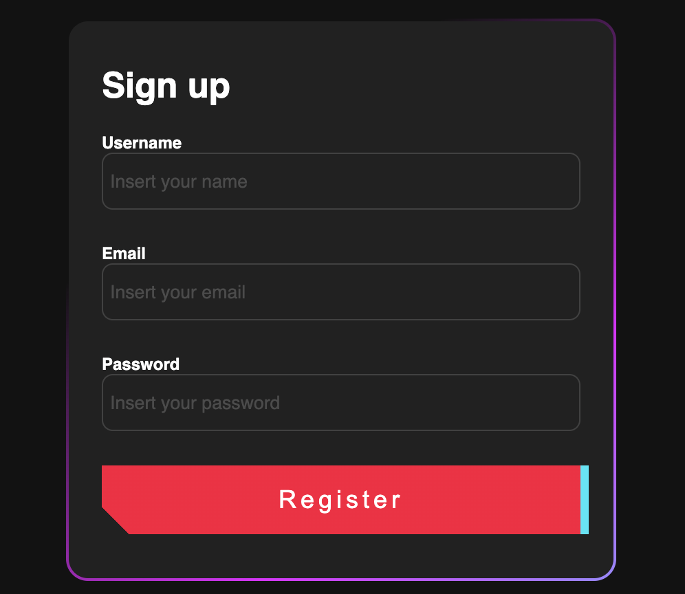
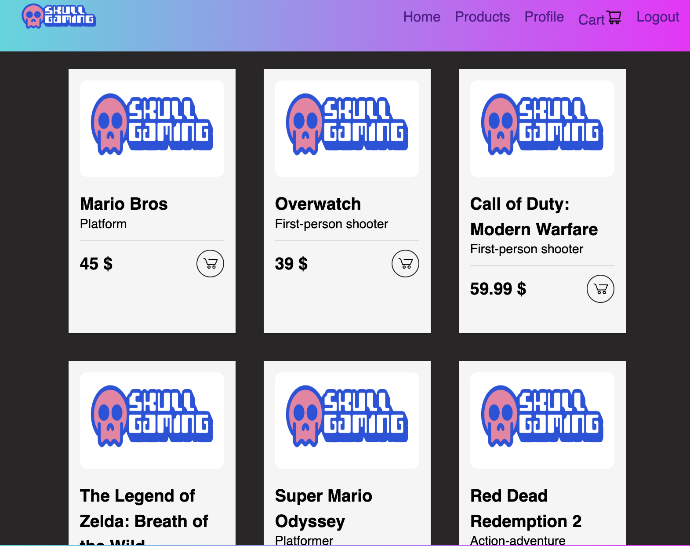
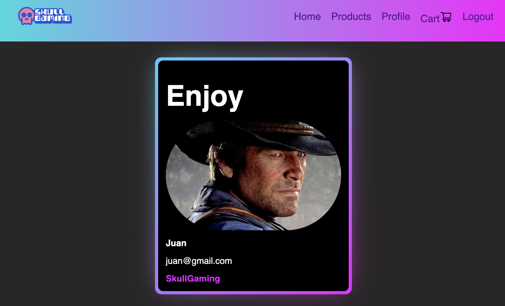
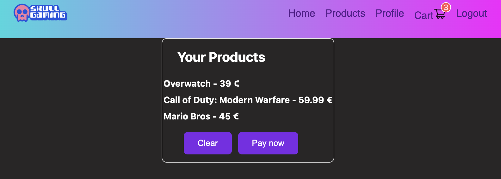

# Proyecto FrontEnd React + Vite

# 🛒E-commerce🛍️

Este es un proyecto de aplicación de e-commerce creado con React. La aplicación permite a los usuarios registrarse, iniciar sesión, ver productos, añadir productos al carrito y realizar pedidos.

## Características

- **Registro e inicio de sesión**: Los usuarios pueden registrarse y iniciar sesión.
- **Ver productos**: Los usuarios pueden ver una lista de productos disponibles.
- **Añadir al carrito**: Los usuarios pueden añadir productos a su carrito.
- **Realizar pedidos**: Los usuarios pueden realizar pedidos de los productos en su carrito.
- **Ver perfil**: Los usuarios pueden ver su perfil.

## Tecnologías utilizadas

- **React**: Biblioteca de JavaScript para construir interfaces de usuario.
- **React Router**: Para la navegación entre páginas.
- **Context API**: Para la gestión del estado global.
- **Axios**: Para realizar solicitudes a la base de datos creada con Sequelize.
- **Sass**: Para el diseño y estilos de la aplicación.
- **UiVerse**: Para el diseñon de componentes como botones, la card de Login y la de perfil
- **Ant Design**: Biblioteca de componentes UI para React.

## Uso
### Navegación

- **Home**: Página de inicio.
- **Registre**: Página para registrarse.
- **Login**: Página para iniciar sesión.
- **Products**: Página para ver productos.
- **Cart**: Página del carrito de compras.
- **Profile**: Página de perfil del usuario.

### Funcionalidades

- **Registro**: Ve a la página de registro y completa el formulario.
- **Inicio de sesión**: Ve a la página de login y completa el formulario.
- **Ver productos**: Ve a la página de productos para ver la lista de productos disponibles.
- **Añadir al carrito**: Añade productos al carrito desde la página de productos.
- **Realizar pedido**: Ve a la página del carrito y realiza un pedido.
- **Ver perfil**: En la página de perfil podras ver una card con tu nombre y correo.

## Imagen Home

## Imagen Sign up

## Imagen Products

## Imagen Profile

## Imagen Cart

## Contribuciones
Las contribuciones son bienvenidas. Si deseas contribuir, por favor sigue los siguientes pasos:

- Haz un fork del repositorio.
- Crea una nueva rama (`git checkout -b feature/nueva-funcionalidad`).
- Realiza los cambios necesarios y haz commit (`git commit -m 'Añadir nueva funcionalidad'`).
- Haz push a la rama (`git push origin feature/nueva-funcionalidad`).
- Abre un Pull Request.

## Desarrollado por:

- **Jairo Núñez**
- **Email**: jaironf.94@gmail.com